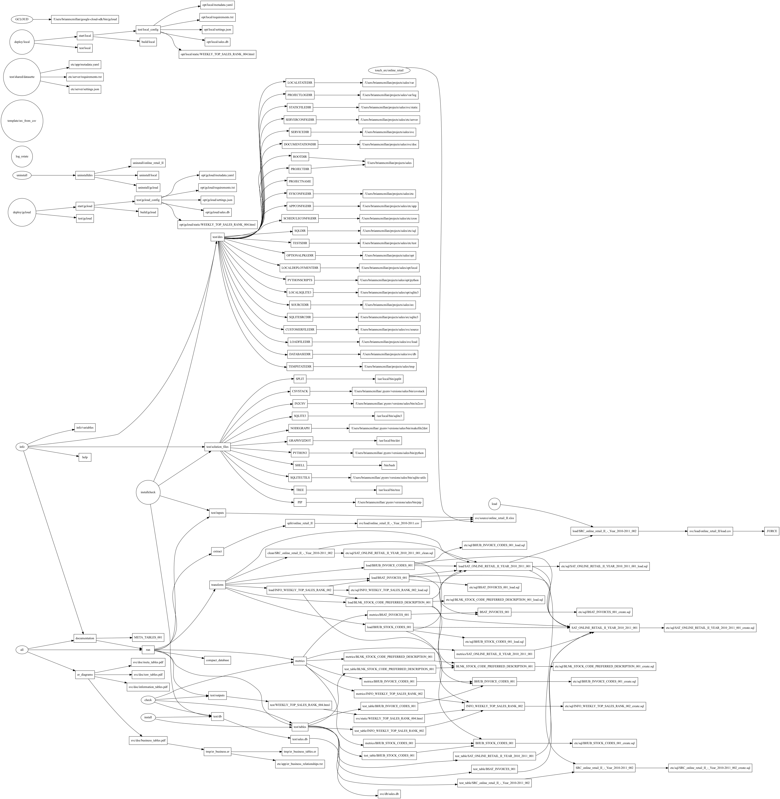

<!---
Document the current project data pipeline.

File name: docs/configuration_management/data_pipeline.md
--->

### Data Pipeline


### Scheduling
|Command|Schedule Execution|Log location|
|---|---|---|
|makefile log_rotate|daily|cron_log.txt|
|makefile all|hourly|cron_log.txt|
|makefile deploy/local|manual|cron_log.txt|

```shell title="crontab.txt"
MAILTO=
#LOG_ROTATE - Rotate the log file every day.
#@daily /usr/bin/make -C </path/to/project/> -f makefile log_rotate >> </path/to/project>/var/log/cron_log.txt 2>&1
#Execute the data pipeline every hour
#*/15 * * * * /usr/bin/make -C </path/to/project/> -f makefile all >> </path/to/project>/var/log/cron_log.txt 2>&1
#deploy/local manually as needed
#0 */2 * * * /usr/bin/make -C </path/to/project/> -f makefile deploy/local >> </path/to/project>/var/log/cron_log.txt 2>&1
```