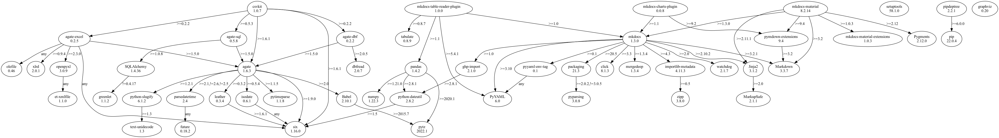

<!---
Document the current state of the software necessary to deliver this project.

File name: docs/configuration_management/software_bom.md
--->

### UNIX Software

=== "brew_packages_base.txt"
    ```shell
    coreutils
    zlib
    openssl
    readline
    xz
    git
    tree
    gawk
    pyenv
    pyenv-virtualenv
    makefile2graph
    graphviz
    ```
=== "brew_packages.txt"
    ```shell
    aom 3.3.0
    aspell 0.60.8
    autoconf 2.71
    brotli 1.0.9
    ca-certificates 2022-03-29
    cairo 1.16.0_5
    coreutils 9.0_1
    datamash 1.7
    docbook 5.1_1
    docbook-xsl 1.79.2_1
    fontconfig 2.14.0
    freetype 2.12.0
    fribidi 1.0.11
    gawk 5.1.1
    gd 2.3.3_2
    gdbm 1.23
    gdk-pixbuf 2.42.8
    gettext 0.21
    ghostscript 9.56.1
    giflib 5.2.1
    git 2.35.3
    glib 2.72.0
    gmp 6.2.1_1
    gnu-getopt 2.37.4
    gobject-introspection 1.72.0
    graphite2 1.3.14
    graphviz 3.0.0
    gts 0.7.6_2
    harfbuzz 4.2.0
    icu4c 70.1
    imagemagick 7.1.0-29_1
    imath 3.1.4
    jasper 3.0.3
    jbig2dec 0.19
    jpeg 9e
    jpeg-xl 0.6.1
    jq 1.6
    libavif 0.10.1
    libde265 1.0.8
    libffi 3.4.2
    libheif 1.12.0_1
    libidn 1.38
    liblqr 0.4.2_1
    libomp 14.0.0
    libpng 1.6.37
    libpthread-stubs 0.4
    libraw 0.20.2_1
    librsvg 2.52.8
    libtiff 4.3.0
    libtool 2.4.7
    libvmaf 2.3.1
    libx11 1.7.5
    libxau 1.0.9
    libxcb 1.14_2
    libxdmcp 1.1.3
    libxext 1.3.4
    libxrender 0.9.10
    little-cms2 2.13.1
    lzo 2.10
    m4 1.4.19
    makefile2graph 2021.11.06
    mpdecimal 2.5.1
    mpfr 4.1.0
    netpbm 10.86.32
    oniguruma 6.9.7.1
    openexr 3.1.5
    openjpeg 2.4.0
    openssl@1.1 1.1.1n
    openssl@3 3.0.2
    pandoc 2.18
    pango 1.50.6
    pcre 8.45
    pcre2 10.39
    pixman 0.40.0
    pkg-config 0.29.2_3
    pyenv 2.2.5
    pyenv-virtualenv 1.1.5
    python@3.9 3.9.12
    readline 8.1.2
    shared-mime-info 2.1
    sqlite 3.38.2
    tree 2.0.2
    webp 1.2.2
    x265 3.5
    xmlto 0.0.28
    xorgproto 2021.5
    xsv 0.13.0
    xz 5.2.5
    zlib 1.2.11
    ```

### Python Software
```shell title="Python Environment"
~/.pyenv/versions/documentation_templates/bin/python
~/.pyenv/versions/documentation_templates/bin/pip
```

=== "requirements_base.txt"
    ```shell
    csvkit==1.0.7
    graphviz==0.20
    mkdocs==1.3.0
    mkdocs-material==8.2.14
    mkdocs-charts-plugin==0.0.8
    mkdocs-table-reader-plugin==1.0.0
    pipdeptree==2.2.1
    ```

=== "requirements.txt"
    ```shell
    agate==1.6.3
    agate-dbf==0.2.2
    agate-excel==0.2.5
    agate-sql==0.5.8
    Babel==2.10.1
    click==8.1.3
    csvkit==1.0.7
    dbfread==2.0.7
    et-xmlfile==1.1.0
    future==0.18.2
    ghp-import==2.1.0
    graphviz==0.20
    greenlet==1.1.2
    importlib-metadata==4.11.3
    isodate==0.6.1
    Jinja2==3.1.2
    leather==0.3.4
    Markdown==3.3.7
    MarkupSafe==2.1.1
    mergedeep==1.3.4
    mkdocs==1.3.0
    mkdocs-charts-plugin==0.0.8
    mkdocs-material==8.2.14
    mkdocs-material-extensions==1.0.3
    mkdocs-table-reader-plugin==1.0.0
    numpy==1.22.3
    olefile==0.46
    openpyxl==3.0.9
    packaging==21.3
    pandas==1.4.2
    parsedatetime==2.4
    pipdeptree==2.2.1
    Pygments==2.12.0
    pymdown-extensions==9.4
    pyparsing==3.0.8
    python-dateutil==2.8.2
    python-slugify==6.1.2
    pytimeparse==1.1.8
    pytz==2022.1
    PyYAML==6.0
    pyyaml_env_tag==0.1
    six==1.16.0
    SQLAlchemy==1.4.36
    tabulate==0.8.9
    text-unidecode==1.3
    watchdog==2.1.7
    xlrd==2.0.1
    zipp==3.8.0
    ```

=== "pipdeptree.yaml"
    ```yaml
    csvkit==1.0.7
    - agate [required: >=1.6.1, installed: 1.6.3]
        - Babel [required: >=2.0, installed: 2.10.1]
        - pytz [required: >=2015.7, installed: 2022.1]
        - isodate [required: >=0.5.4, installed: 0.6.1]
        - six [required: Any, installed: 1.16.0]
        - leather [required: >=0.3.2, installed: 0.3.4]
        - six [required: >=1.6.1, installed: 1.16.0]
        - parsedatetime [required: >=2.1,!=2.6,!=2.5, installed: 2.4]
        - future [required: Any, installed: 0.18.2]
        - python-slugify [required: >=1.2.1, installed: 6.1.2]
        - text-unidecode [required: >=1.3, installed: 1.3]
        - pytimeparse [required: >=1.1.5, installed: 1.1.8]
        - six [required: >=1.9.0, installed: 1.16.0]
    - agate-dbf [required: >=0.2.2, installed: 0.2.2]
        - agate [required: >=1.5.0, installed: 1.6.3]
        - Babel [required: >=2.0, installed: 2.10.1]
            - pytz [required: >=2015.7, installed: 2022.1]
        - isodate [required: >=0.5.4, installed: 0.6.1]
            - six [required: Any, installed: 1.16.0]
        - leather [required: >=0.3.2, installed: 0.3.4]
            - six [required: >=1.6.1, installed: 1.16.0]
        - parsedatetime [required: >=2.1,!=2.6,!=2.5, installed: 2.4]
            - future [required: Any, installed: 0.18.2]
        - python-slugify [required: >=1.2.1, installed: 6.1.2]
            - text-unidecode [required: >=1.3, installed: 1.3]
        - pytimeparse [required: >=1.1.5, installed: 1.1.8]
        - six [required: >=1.9.0, installed: 1.16.0]
        - dbfread [required: >=2.0.5, installed: 2.0.7]
    - agate-excel [required: >=0.2.2, installed: 0.2.5]
        - agate [required: >=1.5.0, installed: 1.6.3]
        - Babel [required: >=2.0, installed: 2.10.1]
            - pytz [required: >=2015.7, installed: 2022.1]
        - isodate [required: >=0.5.4, installed: 0.6.1]
            - six [required: Any, installed: 1.16.0]
        - leather [required: >=0.3.2, installed: 0.3.4]
            - six [required: >=1.6.1, installed: 1.16.0]
        - parsedatetime [required: >=2.1,!=2.6,!=2.5, installed: 2.4]
            - future [required: Any, installed: 0.18.2]
        - python-slugify [required: >=1.2.1, installed: 6.1.2]
            - text-unidecode [required: >=1.3, installed: 1.3]
        - pytimeparse [required: >=1.1.5, installed: 1.1.8]
        - six [required: >=1.9.0, installed: 1.16.0]
        - olefile [required: Any, installed: 0.46]
        - openpyxl [required: >=2.3.0, installed: 3.0.9]
        - et-xmlfile [required: Any, installed: 1.1.0]
        - six [required: Any, installed: 1.16.0]
        - xlrd [required: >=0.9.4, installed: 2.0.1]
    - agate-sql [required: >=0.5.3, installed: 0.5.8]
        - agate [required: >=1.5.0, installed: 1.6.3]
        - Babel [required: >=2.0, installed: 2.10.1]
            - pytz [required: >=2015.7, installed: 2022.1]
        - isodate [required: >=0.5.4, installed: 0.6.1]
            - six [required: Any, installed: 1.16.0]
        - leather [required: >=0.3.2, installed: 0.3.4]
            - six [required: >=1.6.1, installed: 1.16.0]
        - parsedatetime [required: >=2.1,!=2.6,!=2.5, installed: 2.4]
            - future [required: Any, installed: 0.18.2]
        - python-slugify [required: >=1.2.1, installed: 6.1.2]
            - text-unidecode [required: >=1.3, installed: 1.3]
        - pytimeparse [required: >=1.1.5, installed: 1.1.8]
        - six [required: >=1.9.0, installed: 1.16.0]
        - sqlalchemy [required: >=1.0.8, installed: 1.4.36]
        - greenlet [required: !=0.4.17, installed: 1.1.2]
    - six [required: >=1.6.1, installed: 1.16.0]
    graphviz==0.20
    mkdocs-charts-plugin==0.0.8
    - mkdocs [required: >=1.1, installed: 1.3.0]
        - click [required: >=3.3, installed: 8.1.3]
        - ghp-import [required: >=1.0, installed: 2.1.0]
        - python-dateutil [required: >=2.8.1, installed: 2.8.2]
            - six [required: >=1.5, installed: 1.16.0]
        - importlib-metadata [required: >=4.3, installed: 4.11.3]
        - zipp [required: >=0.5, installed: 3.8.0]
        - Jinja2 [required: >=2.10.2, installed: 3.1.2]
        - MarkupSafe [required: >=2.0, installed: 2.1.1]
        - Markdown [required: >=3.2.1, installed: 3.3.7]
        - mergedeep [required: >=1.3.4, installed: 1.3.4]
        - packaging [required: >=20.5, installed: 21.3]
        - pyparsing [required: >=2.0.2,!=3.0.5, installed: 3.0.8]
        - PyYAML [required: >=3.10, installed: 6.0]
        - pyyaml-env-tag [required: >=0.1, installed: 0.1]
        - pyyaml [required: Any, installed: 6.0]
        - watchdog [required: >=2.0, installed: 2.1.7]
    - pymdown-extensions [required: >=9.2, installed: 9.4]
        - markdown [required: >=3.2, installed: 3.3.7]
    mkdocs-material==8.2.14
    - jinja2 [required: >=2.11.1, installed: 3.1.2]
        - MarkupSafe [required: >=2.0, installed: 2.1.1]
    - markdown [required: >=3.2, installed: 3.3.7]
    - mkdocs [required: >=1.3.0, installed: 1.3.0]
        - click [required: >=3.3, installed: 8.1.3]
        - ghp-import [required: >=1.0, installed: 2.1.0]
        - python-dateutil [required: >=2.8.1, installed: 2.8.2]
            - six [required: >=1.5, installed: 1.16.0]
        - importlib-metadata [required: >=4.3, installed: 4.11.3]
        - zipp [required: >=0.5, installed: 3.8.0]
        - Jinja2 [required: >=2.10.2, installed: 3.1.2]
        - MarkupSafe [required: >=2.0, installed: 2.1.1]
        - Markdown [required: >=3.2.1, installed: 3.3.7]
        - mergedeep [required: >=1.3.4, installed: 1.3.4]
        - packaging [required: >=20.5, installed: 21.3]
        - pyparsing [required: >=2.0.2,!=3.0.5, installed: 3.0.8]
        - PyYAML [required: >=3.10, installed: 6.0]
        - pyyaml-env-tag [required: >=0.1, installed: 0.1]
        - pyyaml [required: Any, installed: 6.0]
        - watchdog [required: >=2.0, installed: 2.1.7]
    - mkdocs-material-extensions [required: >=1.0.3, installed: 1.0.3]
    - pygments [required: >=2.12, installed: 2.12.0]
    - pymdown-extensions [required: >=9.4, installed: 9.4]
        - markdown [required: >=3.2, installed: 3.3.7]
    mkdocs-table-reader-plugin==1.0.0
    - mkdocs [required: >=1.0, installed: 1.3.0]
        - click [required: >=3.3, installed: 8.1.3]
        - ghp-import [required: >=1.0, installed: 2.1.0]
        - python-dateutil [required: >=2.8.1, installed: 2.8.2]
            - six [required: >=1.5, installed: 1.16.0]
        - importlib-metadata [required: >=4.3, installed: 4.11.3]
        - zipp [required: >=0.5, installed: 3.8.0]
        - Jinja2 [required: >=2.10.2, installed: 3.1.2]
        - MarkupSafe [required: >=2.0, installed: 2.1.1]
        - Markdown [required: >=3.2.1, installed: 3.3.7]
        - mergedeep [required: >=1.3.4, installed: 1.3.4]
        - packaging [required: >=20.5, installed: 21.3]
        - pyparsing [required: >=2.0.2,!=3.0.5, installed: 3.0.8]
        - PyYAML [required: >=3.10, installed: 6.0]
        - pyyaml-env-tag [required: >=0.1, installed: 0.1]
        - pyyaml [required: Any, installed: 6.0]
        - watchdog [required: >=2.0, installed: 2.1.7]
    - pandas [required: >=1.1, installed: 1.4.2]
        - numpy [required: >=1.21.0, installed: 1.22.3]
        - python-dateutil [required: >=2.8.1, installed: 2.8.2]
        - six [required: >=1.5, installed: 1.16.0]
        - pytz [required: >=2020.1, installed: 2022.1]
    - PyYAML [required: >=5.4.1, installed: 6.0]
    - tabulate [required: >=0.8.7, installed: 0.8.9]
    pipdeptree==2.2.1
    - pip [required: >=6.0.0, installed: 22.0.4]
    setuptools==58.1.0
    ```

=== "pip.json"
    ```json
        [
        {
            "key": "csvkit",
            "package_name": "csvkit",
            "installed_version": "1.0.7",
            "required_version": "1.0.7",
            "dependencies": [
                {
                    "key": "agate",
                    "package_name": "agate",
                    "installed_version": "1.6.3",
                    "required_version": ">=1.6.1",
                    "dependencies": [
                        {
                            "key": "babel",
                            "package_name": "Babel",
                            "installed_version": "2.10.1",
                            "required_version": ">=2.0",
                            "dependencies": [
                                {
                                    "key": "pytz",
                                    "package_name": "pytz",
                                    "installed_version": "2022.1",
                                    "required_version": ">=2015.7",
                                    "dependencies": []
                                }
                            ]
                        },
                        {
                            "key": "isodate",
                            "package_name": "isodate",
                            "installed_version": "0.6.1",
                            "required_version": ">=0.5.4",
                            "dependencies": [
                                {
                                    "key": "six",
                                    "package_name": "six",
                                    "installed_version": "1.16.0",
                                    "required_version": "Any",
                                    "dependencies": []
                                }
                            ]
                        },
                        {
                            "key": "leather",
                            "package_name": "leather",
                            "installed_version": "0.3.4",
                            "required_version": ">=0.3.2",
                            "dependencies": [
                                {
                                    "key": "six",
                                    "package_name": "six",
                                    "installed_version": "1.16.0",
                                    "required_version": ">=1.6.1",
                                    "dependencies": []
                                }
                            ]
                        },
                        {
                            "key": "parsedatetime",
                            "package_name": "parsedatetime",
                            "installed_version": "2.4",
                            "required_version": ">=2.1,!=2.6,!=2.5",
                            "dependencies": [
                                {
                                    "key": "future",
                                    "package_name": "future",
                                    "installed_version": "0.18.2",
                                    "required_version": "Any",
                                    "dependencies": []
                                }
                            ]
                        },
                        {
                            "key": "python-slugify",
                            "package_name": "python-slugify",
                            "installed_version": "6.1.2",
                            "required_version": ">=1.2.1",
                            "dependencies": [
                                {
                                    "key": "text-unidecode",
                                    "package_name": "text-unidecode",
                                    "installed_version": "1.3",
                                    "required_version": ">=1.3",
                                    "dependencies": []
                                }
                            ]
                        },
                        {
                            "key": "pytimeparse",
                            "package_name": "pytimeparse",
                            "installed_version": "1.1.8",
                            "required_version": ">=1.1.5",
                            "dependencies": []
                        },
                        {
                            "key": "six",
                            "package_name": "six",
                            "installed_version": "1.16.0",
                            "required_version": ">=1.9.0",
                            "dependencies": []
                        }
                    ]
                },
                {
                    "key": "agate-dbf",
                    "package_name": "agate-dbf",
                    "installed_version": "0.2.2",
                    "required_version": ">=0.2.2",
                    "dependencies": [
                        {
                            "key": "agate",
                            "package_name": "agate",
                            "installed_version": "1.6.3",
                            "required_version": ">=1.5.0",
                            "dependencies": [
                                {
                                    "key": "babel",
                                    "package_name": "Babel",
                                    "installed_version": "2.10.1",
                                    "required_version": ">=2.0",
                                    "dependencies": [
                                        {
                                            "key": "pytz",
                                            "package_name": "pytz",
                                            "installed_version": "2022.1",
                                            "required_version": ">=2015.7",
                                            "dependencies": []
                                        }
                                    ]
                                },
                                {
                                    "key": "isodate",
                                    "package_name": "isodate",
                                    "installed_version": "0.6.1",
                                    "required_version": ">=0.5.4",
                                    "dependencies": [
                                        {
                                            "key": "six",
                                            "package_name": "six",
                                            "installed_version": "1.16.0",
                                            "required_version": "Any",
                                            "dependencies": []
                                        }
                                    ]
                                },
                                {
                                    "key": "leather",
                                    "package_name": "leather",
                                    "installed_version": "0.3.4",
                                    "required_version": ">=0.3.2",
                                    "dependencies": [
                                        {
                                            "key": "six",
                                            "package_name": "six",
                                            "installed_version": "1.16.0",
                                            "required_version": ">=1.6.1",
                                            "dependencies": []
                                        }
                                    ]
                                },
                                {
                                    "key": "parsedatetime",
                                    "package_name": "parsedatetime",
                                    "installed_version": "2.4",
                                    "required_version": ">=2.1,!=2.6,!=2.5",
                                    "dependencies": [
                                        {
                                            "key": "future",
                                            "package_name": "future",
                                            "installed_version": "0.18.2",
                                            "required_version": "Any",
                                            "dependencies": []
                                        }
                                    ]
                                },
                                {
                                    "key": "python-slugify",
                                    "package_name": "python-slugify",
                                    "installed_version": "6.1.2",
                                    "required_version": ">=1.2.1",
                                    "dependencies": [
                                        {
                                            "key": "text-unidecode",
                                            "package_name": "text-unidecode",
                                            "installed_version": "1.3",
                                            "required_version": ">=1.3",
                                            "dependencies": []
                                        }
                                    ]
                                },
                                {
                                    "key": "pytimeparse",
                                    "package_name": "pytimeparse",
                                    "installed_version": "1.1.8",
                                    "required_version": ">=1.1.5",
                                    "dependencies": []
                                },
                                {
                                    "key": "six",
                                    "package_name": "six",
                                    "installed_version": "1.16.0",
                                    "required_version": ">=1.9.0",
                                    "dependencies": []
                                }
                            ]
                        },
                        {
                            "key": "dbfread",
                            "package_name": "dbfread",
                            "installed_version": "2.0.7",
                            "required_version": ">=2.0.5",
                            "dependencies": []
                        }
                    ]
                },
                {
                    "key": "agate-excel",
                    "package_name": "agate-excel",
                    "installed_version": "0.2.5",
                    "required_version": ">=0.2.2",
                    "dependencies": [
                        {
                            "key": "agate",
                            "package_name": "agate",
                            "installed_version": "1.6.3",
                            "required_version": ">=1.5.0",
                            "dependencies": [
                                {
                                    "key": "babel",
                                    "package_name": "Babel",
                                    "installed_version": "2.10.1",
                                    "required_version": ">=2.0",
                                    "dependencies": [
                                        {
                                            "key": "pytz",
                                            "package_name": "pytz",
                                            "installed_version": "2022.1",
                                            "required_version": ">=2015.7",
                                            "dependencies": []
                                        }
                                    ]
                                },
                                {
                                    "key": "isodate",
                                    "package_name": "isodate",
                                    "installed_version": "0.6.1",
                                    "required_version": ">=0.5.4",
                                    "dependencies": [
                                        {
                                            "key": "six",
                                            "package_name": "six",
                                            "installed_version": "1.16.0",
                                            "required_version": "Any",
                                            "dependencies": []
                                        }
                                    ]
                                },
                                {
                                    "key": "leather",
                                    "package_name": "leather",
                                    "installed_version": "0.3.4",
                                    "required_version": ">=0.3.2",
                                    "dependencies": [
                                        {
                                            "key": "six",
                                            "package_name": "six",
                                            "installed_version": "1.16.0",
                                            "required_version": ">=1.6.1",
                                            "dependencies": []
                                        }
                                    ]
                                },
                                {
                                    "key": "parsedatetime",
                                    "package_name": "parsedatetime",
                                    "installed_version": "2.4",
                                    "required_version": ">=2.1,!=2.6,!=2.5",
                                    "dependencies": [
                                        {
                                            "key": "future",
                                            "package_name": "future",
                                            "installed_version": "0.18.2",
                                            "required_version": "Any",
                                            "dependencies": []
                                        }
                                    ]
                                },
                                {
                                    "key": "python-slugify",
                                    "package_name": "python-slugify",
                                    "installed_version": "6.1.2",
                                    "required_version": ">=1.2.1",
                                    "dependencies": [
                                        {
                                            "key": "text-unidecode",
                                            "package_name": "text-unidecode",
                                            "installed_version": "1.3",
                                            "required_version": ">=1.3",
                                            "dependencies": []
                                        }
                                    ]
                                },
                                {
                                    "key": "pytimeparse",
                                    "package_name": "pytimeparse",
                                    "installed_version": "1.1.8",
                                    "required_version": ">=1.1.5",
                                    "dependencies": []
                                },
                                {
                                    "key": "six",
                                    "package_name": "six",
                                    "installed_version": "1.16.0",
                                    "required_version": ">=1.9.0",
                                    "dependencies": []
                                }
                            ]
                        },
                        {
                            "key": "olefile",
                            "package_name": "olefile",
                            "installed_version": "0.46",
                            "required_version": "Any",
                            "dependencies": []
                        },
                        {
                            "key": "openpyxl",
                            "package_name": "openpyxl",
                            "installed_version": "3.0.9",
                            "required_version": ">=2.3.0",
                            "dependencies": [
                                {
                                    "key": "et-xmlfile",
                                    "package_name": "et-xmlfile",
                                    "installed_version": "1.1.0",
                                    "required_version": "Any",
                                    "dependencies": []
                                }
                            ]
                        },
                        {
                            "key": "six",
                            "package_name": "six",
                            "installed_version": "1.16.0",
                            "required_version": "Any",
                            "dependencies": []
                        },
                        {
                            "key": "xlrd",
                            "package_name": "xlrd",
                            "installed_version": "2.0.1",
                            "required_version": ">=0.9.4",
                            "dependencies": []
                        }
                    ]
                },
                {
                    "key": "agate-sql",
                    "package_name": "agate-sql",
                    "installed_version": "0.5.8",
                    "required_version": ">=0.5.3",
                    "dependencies": [
                        {
                            "key": "agate",
                            "package_name": "agate",
                            "installed_version": "1.6.3",
                            "required_version": ">=1.5.0",
                            "dependencies": [
                                {
                                    "key": "babel",
                                    "package_name": "Babel",
                                    "installed_version": "2.10.1",
                                    "required_version": ">=2.0",
                                    "dependencies": [
                                        {
                                            "key": "pytz",
                                            "package_name": "pytz",
                                            "installed_version": "2022.1",
                                            "required_version": ">=2015.7",
                                            "dependencies": []
                                        }
                                    ]
                                },
                                {
                                    "key": "isodate",
                                    "package_name": "isodate",
                                    "installed_version": "0.6.1",
                                    "required_version": ">=0.5.4",
                                    "dependencies": [
                                        {
                                            "key": "six",
                                            "package_name": "six",
                                            "installed_version": "1.16.0",
                                            "required_version": "Any",
                                            "dependencies": []
                                        }
                                    ]
                                },
                                {
                                    "key": "leather",
                                    "package_name": "leather",
                                    "installed_version": "0.3.4",
                                    "required_version": ">=0.3.2",
                                    "dependencies": [
                                        {
                                            "key": "six",
                                            "package_name": "six",
                                            "installed_version": "1.16.0",
                                            "required_version": ">=1.6.1",
                                            "dependencies": []
                                        }
                                    ]
                                },
                                {
                                    "key": "parsedatetime",
                                    "package_name": "parsedatetime",
                                    "installed_version": "2.4",
                                    "required_version": ">=2.1,!=2.6,!=2.5",
                                    "dependencies": [
                                        {
                                            "key": "future",
                                            "package_name": "future",
                                            "installed_version": "0.18.2",
                                            "required_version": "Any",
                                            "dependencies": []
                                        }
                                    ]
                                },
                                {
                                    "key": "python-slugify",
                                    "package_name": "python-slugify",
                                    "installed_version": "6.1.2",
                                    "required_version": ">=1.2.1",
                                    "dependencies": [
                                        {
                                            "key": "text-unidecode",
                                            "package_name": "text-unidecode",
                                            "installed_version": "1.3",
                                            "required_version": ">=1.3",
                                            "dependencies": []
                                        }
                                    ]
                                },
                                {
                                    "key": "pytimeparse",
                                    "package_name": "pytimeparse",
                                    "installed_version": "1.1.8",
                                    "required_version": ">=1.1.5",
                                    "dependencies": []
                                },
                                {
                                    "key": "six",
                                    "package_name": "six",
                                    "installed_version": "1.16.0",
                                    "required_version": ">=1.9.0",
                                    "dependencies": []
                                }
                            ]
                        },
                        {
                            "key": "sqlalchemy",
                            "package_name": "sqlalchemy",
                            "installed_version": "1.4.36",
                            "required_version": ">=1.0.8",
                            "dependencies": [
                                {
                                    "key": "greenlet",
                                    "package_name": "greenlet",
                                    "installed_version": "1.1.2",
                                    "required_version": "!=0.4.17",
                                    "dependencies": []
                                }
                            ]
                        }
                    ]
                },
                {
                    "key": "six",
                    "package_name": "six",
                    "installed_version": "1.16.0",
                    "required_version": ">=1.6.1",
                    "dependencies": []
                }
            ]
        },
        {
            "key": "graphviz",
            "package_name": "graphviz",
            "installed_version": "0.20",
            "required_version": "0.20",
            "dependencies": []
        },
        {
            "key": "mkdocs-charts-plugin",
            "package_name": "mkdocs-charts-plugin",
            "installed_version": "0.0.8",
            "required_version": "0.0.8",
            "dependencies": [
                {
                    "key": "mkdocs",
                    "package_name": "mkdocs",
                    "installed_version": "1.3.0",
                    "required_version": ">=1.1",
                    "dependencies": [
                        {
                            "key": "click",
                            "package_name": "click",
                            "installed_version": "8.1.3",
                            "required_version": ">=3.3",
                            "dependencies": []
                        },
                        {
                            "key": "ghp-import",
                            "package_name": "ghp-import",
                            "installed_version": "2.1.0",
                            "required_version": ">=1.0",
                            "dependencies": [
                                {
                                    "key": "python-dateutil",
                                    "package_name": "python-dateutil",
                                    "installed_version": "2.8.2",
                                    "required_version": ">=2.8.1",
                                    "dependencies": [
                                        {
                                            "key": "six",
                                            "package_name": "six",
                                            "installed_version": "1.16.0",
                                            "required_version": ">=1.5",
                                            "dependencies": []
                                        }
                                    ]
                                }
                            ]
                        },
                        {
                            "key": "importlib-metadata",
                            "package_name": "importlib-metadata",
                            "installed_version": "4.11.3",
                            "required_version": ">=4.3",
                            "dependencies": [
                                {
                                    "key": "zipp",
                                    "package_name": "zipp",
                                    "installed_version": "3.8.0",
                                    "required_version": ">=0.5",
                                    "dependencies": []
                                }
                            ]
                        },
                        {
                            "key": "jinja2",
                            "package_name": "Jinja2",
                            "installed_version": "3.1.2",
                            "required_version": ">=2.10.2",
                            "dependencies": [
                                {
                                    "key": "markupsafe",
                                    "package_name": "MarkupSafe",
                                    "installed_version": "2.1.1",
                                    "required_version": ">=2.0",
                                    "dependencies": []
                                }
                            ]
                        },
                        {
                            "key": "markdown",
                            "package_name": "Markdown",
                            "installed_version": "3.3.7",
                            "required_version": ">=3.2.1",
                            "dependencies": []
                        },
                        {
                            "key": "mergedeep",
                            "package_name": "mergedeep",
                            "installed_version": "1.3.4",
                            "required_version": ">=1.3.4",
                            "dependencies": []
                        },
                        {
                            "key": "packaging",
                            "package_name": "packaging",
                            "installed_version": "21.3",
                            "required_version": ">=20.5",
                            "dependencies": [
                                {
                                    "key": "pyparsing",
                                    "package_name": "pyparsing",
                                    "installed_version": "3.0.8",
                                    "required_version": ">=2.0.2,!=3.0.5",
                                    "dependencies": []
                                }
                            ]
                        },
                        {
                            "key": "pyyaml",
                            "package_name": "PyYAML",
                            "installed_version": "6.0",
                            "required_version": ">=3.10",
                            "dependencies": []
                        },
                        {
                            "key": "pyyaml-env-tag",
                            "package_name": "pyyaml-env-tag",
                            "installed_version": "0.1",
                            "required_version": ">=0.1",
                            "dependencies": [
                                {
                                    "key": "pyyaml",
                                    "package_name": "pyyaml",
                                    "installed_version": "6.0",
                                    "required_version": "Any",
                                    "dependencies": []
                                }
                            ]
                        },
                        {
                            "key": "watchdog",
                            "package_name": "watchdog",
                            "installed_version": "2.1.7",
                            "required_version": ">=2.0",
                            "dependencies": []
                        }
                    ]
                },
                {
                    "key": "pymdown-extensions",
                    "package_name": "pymdown-extensions",
                    "installed_version": "9.4",
                    "required_version": ">=9.2",
                    "dependencies": [
                        {
                            "key": "markdown",
                            "package_name": "markdown",
                            "installed_version": "3.3.7",
                            "required_version": ">=3.2",
                            "dependencies": []
                        }
                    ]
                }
            ]
        },
        {
            "key": "mkdocs-material",
            "package_name": "mkdocs-material",
            "installed_version": "8.2.14",
            "required_version": "8.2.14",
            "dependencies": [
                {
                    "key": "jinja2",
                    "package_name": "jinja2",
                    "installed_version": "3.1.2",
                    "required_version": ">=2.11.1",
                    "dependencies": [
                        {
                            "key": "markupsafe",
                            "package_name": "MarkupSafe",
                            "installed_version": "2.1.1",
                            "required_version": ">=2.0",
                            "dependencies": []
                        }
                    ]
                },
                {
                    "key": "markdown",
                    "package_name": "markdown",
                    "installed_version": "3.3.7",
                    "required_version": ">=3.2",
                    "dependencies": []
                },
                {
                    "key": "mkdocs",
                    "package_name": "mkdocs",
                    "installed_version": "1.3.0",
                    "required_version": ">=1.3.0",
                    "dependencies": [
                        {
                            "key": "click",
                            "package_name": "click",
                            "installed_version": "8.1.3",
                            "required_version": ">=3.3",
                            "dependencies": []
                        },
                        {
                            "key": "ghp-import",
                            "package_name": "ghp-import",
                            "installed_version": "2.1.0",
                            "required_version": ">=1.0",
                            "dependencies": [
                                {
                                    "key": "python-dateutil",
                                    "package_name": "python-dateutil",
                                    "installed_version": "2.8.2",
                                    "required_version": ">=2.8.1",
                                    "dependencies": [
                                        {
                                            "key": "six",
                                            "package_name": "six",
                                            "installed_version": "1.16.0",
                                            "required_version": ">=1.5",
                                            "dependencies": []
                                        }
                                    ]
                                }
                            ]
                        },
                        {
                            "key": "importlib-metadata",
                            "package_name": "importlib-metadata",
                            "installed_version": "4.11.3",
                            "required_version": ">=4.3",
                            "dependencies": [
                                {
                                    "key": "zipp",
                                    "package_name": "zipp",
                                    "installed_version": "3.8.0",
                                    "required_version": ">=0.5",
                                    "dependencies": []
                                }
                            ]
                        },
                        {
                            "key": "jinja2",
                            "package_name": "Jinja2",
                            "installed_version": "3.1.2",
                            "required_version": ">=2.10.2",
                            "dependencies": [
                                {
                                    "key": "markupsafe",
                                    "package_name": "MarkupSafe",
                                    "installed_version": "2.1.1",
                                    "required_version": ">=2.0",
                                    "dependencies": []
                                }
                            ]
                        },
                        {
                            "key": "markdown",
                            "package_name": "Markdown",
                            "installed_version": "3.3.7",
                            "required_version": ">=3.2.1",
                            "dependencies": []
                        },
                        {
                            "key": "mergedeep",
                            "package_name": "mergedeep",
                            "installed_version": "1.3.4",
                            "required_version": ">=1.3.4",
                            "dependencies": []
                        },
                        {
                            "key": "packaging",
                            "package_name": "packaging",
                            "installed_version": "21.3",
                            "required_version": ">=20.5",
                            "dependencies": [
                                {
                                    "key": "pyparsing",
                                    "package_name": "pyparsing",
                                    "installed_version": "3.0.8",
                                    "required_version": ">=2.0.2,!=3.0.5",
                                    "dependencies": []
                                }
                            ]
                        },
                        {
                            "key": "pyyaml",
                            "package_name": "PyYAML",
                            "installed_version": "6.0",
                            "required_version": ">=3.10",
                            "dependencies": []
                        },
                        {
                            "key": "pyyaml-env-tag",
                            "package_name": "pyyaml-env-tag",
                            "installed_version": "0.1",
                            "required_version": ">=0.1",
                            "dependencies": [
                                {
                                    "key": "pyyaml",
                                    "package_name": "pyyaml",
                                    "installed_version": "6.0",
                                    "required_version": "Any",
                                    "dependencies": []
                                }
                            ]
                        },
                        {
                            "key": "watchdog",
                            "package_name": "watchdog",
                            "installed_version": "2.1.7",
                            "required_version": ">=2.0",
                            "dependencies": []
                        }
                    ]
                },
                {
                    "key": "mkdocs-material-extensions",
                    "package_name": "mkdocs-material-extensions",
                    "installed_version": "1.0.3",
                    "required_version": ">=1.0.3",
                    "dependencies": []
                },
                {
                    "key": "pygments",
                    "package_name": "pygments",
                    "installed_version": "2.12.0",
                    "required_version": ">=2.12",
                    "dependencies": []
                },
                {
                    "key": "pymdown-extensions",
                    "package_name": "pymdown-extensions",
                    "installed_version": "9.4",
                    "required_version": ">=9.4",
                    "dependencies": [
                        {
                            "key": "markdown",
                            "package_name": "markdown",
                            "installed_version": "3.3.7",
                            "required_version": ">=3.2",
                            "dependencies": []
                        }
                    ]
                }
            ]
        },
        {
            "key": "mkdocs-table-reader-plugin",
            "package_name": "mkdocs-table-reader-plugin",
            "installed_version": "1.0.0",
            "required_version": "1.0.0",
            "dependencies": [
                {
                    "key": "mkdocs",
                    "package_name": "mkdocs",
                    "installed_version": "1.3.0",
                    "required_version": ">=1.0",
                    "dependencies": [
                        {
                            "key": "click",
                            "package_name": "click",
                            "installed_version": "8.1.3",
                            "required_version": ">=3.3",
                            "dependencies": []
                        },
                        {
                            "key": "ghp-import",
                            "package_name": "ghp-import",
                            "installed_version": "2.1.0",
                            "required_version": ">=1.0",
                            "dependencies": [
                                {
                                    "key": "python-dateutil",
                                    "package_name": "python-dateutil",
                                    "installed_version": "2.8.2",
                                    "required_version": ">=2.8.1",
                                    "dependencies": [
                                        {
                                            "key": "six",
                                            "package_name": "six",
                                            "installed_version": "1.16.0",
                                            "required_version": ">=1.5",
                                            "dependencies": []
                                        }
                                    ]
                                }
                            ]
                        },
                        {
                            "key": "importlib-metadata",
                            "package_name": "importlib-metadata",
                            "installed_version": "4.11.3",
                            "required_version": ">=4.3",
                            "dependencies": [
                                {
                                    "key": "zipp",
                                    "package_name": "zipp",
                                    "installed_version": "3.8.0",
                                    "required_version": ">=0.5",
                                    "dependencies": []
                                }
                            ]
                        },
                        {
                            "key": "jinja2",
                            "package_name": "Jinja2",
                            "installed_version": "3.1.2",
                            "required_version": ">=2.10.2",
                            "dependencies": [
                                {
                                    "key": "markupsafe",
                                    "package_name": "MarkupSafe",
                                    "installed_version": "2.1.1",
                                    "required_version": ">=2.0",
                                    "dependencies": []
                                }
                            ]
                        },
                        {
                            "key": "markdown",
                            "package_name": "Markdown",
                            "installed_version": "3.3.7",
                            "required_version": ">=3.2.1",
                            "dependencies": []
                        },
                        {
                            "key": "mergedeep",
                            "package_name": "mergedeep",
                            "installed_version": "1.3.4",
                            "required_version": ">=1.3.4",
                            "dependencies": []
                        },
                        {
                            "key": "packaging",
                            "package_name": "packaging",
                            "installed_version": "21.3",
                            "required_version": ">=20.5",
                            "dependencies": [
                                {
                                    "key": "pyparsing",
                                    "package_name": "pyparsing",
                                    "installed_version": "3.0.8",
                                    "required_version": ">=2.0.2,!=3.0.5",
                                    "dependencies": []
                                }
                            ]
                        },
                        {
                            "key": "pyyaml",
                            "package_name": "PyYAML",
                            "installed_version": "6.0",
                            "required_version": ">=3.10",
                            "dependencies": []
                        },
                        {
                            "key": "pyyaml-env-tag",
                            "package_name": "pyyaml-env-tag",
                            "installed_version": "0.1",
                            "required_version": ">=0.1",
                            "dependencies": [
                                {
                                    "key": "pyyaml",
                                    "package_name": "pyyaml",
                                    "installed_version": "6.0",
                                    "required_version": "Any",
                                    "dependencies": []
                                }
                            ]
                        },
                        {
                            "key": "watchdog",
                            "package_name": "watchdog",
                            "installed_version": "2.1.7",
                            "required_version": ">=2.0",
                            "dependencies": []
                        }
                    ]
                },
                {
                    "key": "pandas",
                    "package_name": "pandas",
                    "installed_version": "1.4.2",
                    "required_version": ">=1.1",
                    "dependencies": [
                        {
                            "key": "numpy",
                            "package_name": "numpy",
                            "installed_version": "1.22.3",
                            "required_version": ">=1.21.0",
                            "dependencies": []
                        },
                        {
                            "key": "python-dateutil",
                            "package_name": "python-dateutil",
                            "installed_version": "2.8.2",
                            "required_version": ">=2.8.1",
                            "dependencies": [
                                {
                                    "key": "six",
                                    "package_name": "six",
                                    "installed_version": "1.16.0",
                                    "required_version": ">=1.5",
                                    "dependencies": []
                                }
                            ]
                        },
                        {
                            "key": "pytz",
                            "package_name": "pytz",
                            "installed_version": "2022.1",
                            "required_version": ">=2020.1",
                            "dependencies": []
                        }
                    ]
                },
                {
                    "key": "pyyaml",
                    "package_name": "PyYAML",
                    "installed_version": "6.0",
                    "required_version": ">=5.4.1",
                    "dependencies": []
                },
                {
                    "key": "tabulate",
                    "package_name": "tabulate",
                    "installed_version": "0.8.9",
                    "required_version": ">=0.8.7",
                    "dependencies": []
                }
            ]
        },
        {
            "key": "pipdeptree",
            "package_name": "pipdeptree",
            "installed_version": "2.2.1",
            "required_version": "2.2.1",
            "dependencies": [
                {
                    "key": "pip",
                    "package_name": "pip",
                    "installed_version": "22.0.4",
                    "required_version": ">=6.0.0",
                    "dependencies": []
                }
            ]
        },
        {
            "key": "setuptools",
            "package_name": "setuptools",
            "installed_version": "58.1.0",
            "required_version": "58.1.0",
            "dependencies": []
        }
    ]
    ```

#### Software dependencies 

