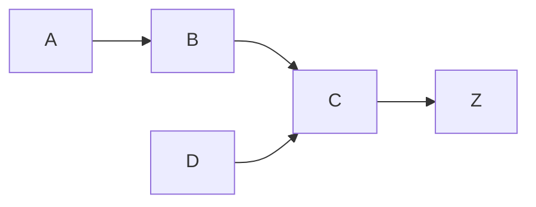

<!---
The Data Product Context (DPC) document is used to record the high level features and associated requirements for a data product. This document will be used to help describe the work to be done.

File name: DPC-###_<Data Product>.md
--->

<!---## DPC-### { Data Product Context }--->

!!! tldr "TL;DR"  
<!---### TL;DR ---> 
    **IN ORDER TO** { ... }  
    **AS A** { ... }  
    **I WANT** { ... }  

!!! info  
<!---### Info--->
    **Status:** { **CREATED** | IN REVIEW | STARTED | COMPLETED | CANCELED }  
    **Decision Maker Name:** { name }  
    **Decision Maker Email:** { email }  
    **Technical Contact Name:** { name }  
    **Technical Contact Email:** { email }  
    **Other contributors:** { email }  
    **Linked PRD / RFC:** [RFC-###]()  

**LINK:**  { [URL]() }  

----

### Target Value
<!--- Document the expected financial impact of this project. May be expressed as quantity or quality values.--->

<!--- At this point in the project life cycle, we are estimating the rough costs associated with this feature for prioritization purposes only. The scoring values are always in the context of other opportunities and should be rescored on each evaluation.  --->

<!---One scoring method is to use a modified Fibonacci sequence for each value (1, 2, 3, 5, 8, 13, 21). Benefits and Urgency are scored highest to lowest (lowest benefit = 1) and Duration is scored lowest to highest (e.g. shortest duration = 1). See Ch. 9: Final Iteration - Innovation and Planning in the book "Building Data Products: Introduction to Data and Analytics Engineering for non-programmers"  --->

|Benefit Value (B) | Urgency Value (U) | Duration Value (D) | Score (B*U)/D) |
|---|---|---|---|
|{ # }|{ # }|{ # }|{ # }| 

<!---An alternative scoring method: The value assigned to the project is determined by providing each stakeholder an equal amount of money to spend on any of the features being evaluated with this process. The total amount in the pool is determined by multiplying the number of developers times the number of months in the timeframe (e.g. 10 developers * 3 months * $5 = $150 total). If you have five people making the prioritization decisions, then the $150 is divided by five. This provides each person $30 to vote with.

**Resource estimate:** { XX people }  
**Time estimate:**  { XX time }  
**Feature cost:** { $5 per FTE per month * time * people }  

### Final business value score: { $## }  
--->

<!--- Another alternative is to estimate the financial impact to the project. --->
<!---
| Units Sold | Unit Price | Raw Materials (TVC) | Operating Expanse | Financial Throughput |
|---|---|---|---|---|
| { increased } | { decreased } | { 3 contract devs. } | { increased $1000/mo x 4 monthss} | { Increased } |
--->

++++

### Decision Maker Motivation
#### Triggering Event
When { ... }  
#### Core Problem
We [observe, can't, predict] { ... }  
#### Business Questions
By answering { ... }  
#### Business value
We will gain { ... }  
#### Bootstrap
Today, we { ... }  
#### Optional Solution
We [could] also { ... }  
#### Old Habits
We keep doing this because { ... }  
#### New Habits 
We want to { ... }  
#### Beliefs & Assumptions
Assuming { ... }  

----

### Actions
Without any additional information we will { action taken }  

|Alternative Actions|When would you do something else?|  
|---|---|  
|{...}|{...}|  

#### Taking Action
These decisions are made every { ... }  

Who needs to act on this decision?  
- { ... }  
- { ... }  

What would it take to change your mind?  
{...}  

What is the impact of changing when you shouldn't (Type 1 mistake)?  
{...}  

What is the impact of not changing when you should (Type 2 mistake)?  
{...}  

What information do you need to take action?  
- { ... }  
- { ... }  

----

### Value Chain
Illustrate the value chain components or process flow using [Mermaid](https://mermaid-js.github.io/mermaid/#/) notation. 

**Value Chain**  

++++

### Technical Considerations
#### Events / Actions / Entities
- { Event description }  
- { Action description }  
- { Business Entity description }  

#### Data Products (Reports / Dashboards / APIs)   
- { Report description }  
- { API description }  
- { Dashboard description }  

#### Systems
|Source Systems| Target Systems | Interface Pattern | Contact |
|---|---|---|---|
| {...} | {...} | { ... } | { ... } |

#### Data Size
|Entity|Table count|Record Count|Record Size|Rate of Change|
|---|---|---|---|---|
| { ... } | { # } | { # } | { # } | { ... } |

#### Business Metrics
| Metric Name | Description | Unit of Measure | Base Interval | Threshold Description |  
|---|---|---|---|---|  
|  { ... } | { ... } | { ... } | { ... } | { ... } |  

#### Activities
| Activity Name | Revenue Impact | Feature 1 Name | Feature 2 Name | Feature 2 Name |  
|---|---|---|---|---|  
|  { ... } | { ... } | { ... } | { ... } | { ... } |  

#### Technical Assumptions
- { Assumption 1 }  
- { Assumption 2 }  
- { Assumption 3 }  

++++

### References and notes
{ Lorem ipsum dolor sit amet, consectetur adipiscing elit, eiusmod tempor. }  
