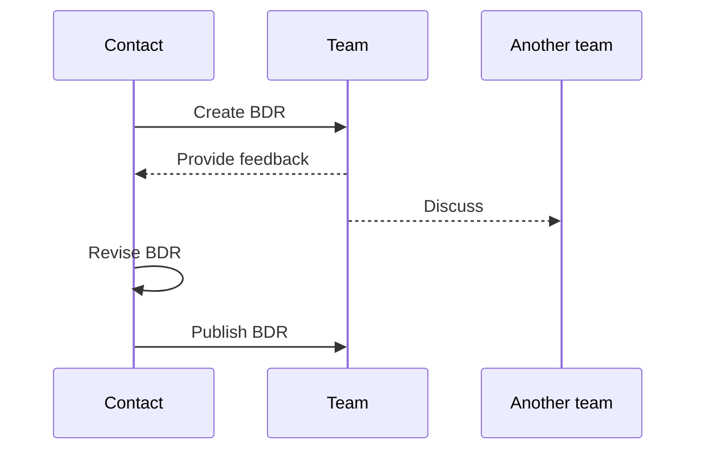

<!---
The decision record document is used to record an important decision as well as the context and expected outcomes. The most common use cases are when a decision is controversial, complex, or a compromise. Typically, these decisions are related to business (BDR) or architectural (ADR) issues. More detailed discussions can be recorded in a Request for Comment (RFC) document. These should be linked to the decision record.

File name: [A,B]DR-###_<TITLE>.md
--->

!!! tldr "TL;DR"  
    { Lorem ipsum dolor sit amet }  
    
    **IN ORDER TO** { ... }  
    **AS A** { ... }  
    **I WANT** { ... }  
    **GIVEN** { ... }  
    **WHEN** { ... }  
    **THEN** { ... }  

!!! info  
    **Status:** { **PROPOSED**, ACCEPTED, REJECTED, SUPERSEDED }  
    **Superseded by:** { [BDR-123]() }  
    **Contact Name:** { name }  
    **Contact email:** { email }  
    **Linked RFC:** { [RFC-XXX]() }  

|**Created Date:**|**Rejected Date:**|**Accepted Date:**|**Superseded Date:**|
|---|---|---|---|
|{ YYYY-MM-DD }|{ YYYY-MM-DD }|{ YYYY-MM-DD }|{ YYYY-MM-DD }|

### Context
{ Lorem ipsum dolor sit amet, consectetur adipiscing elit, sed do eiusmod tempor. }  

### Decision
{ Lorem ipsum dolor sit amet, consectetur adipiscing elit, sed do eiusmod tempor. }  
**We will** { ... }  
**We will not** { ... }  

### Process
{ Lorem ipsum dolor sit amet, consectetur adipiscing elit, sed do eiusmod tempor. }  
<!--- Sequence diagrams are useful for depicting the interactions between the people involved in the decision making process. --->

### Metrics
<!--- Use Frequency to record the frequency a decision is made. Use the Cycle Time to record the elapsed time it takes to make the decision. The Feedback Time is the time between the decision being made and the outcome.--->
{ Lorem ipsum dolor sit amet, consectetur adipiscing elit, sed do eiusmod tempor. }  
**Expected Frequency:** { hours, days, weeks, months, quarters, years, as needed }  
**Expected Cycle Time:** { X hours, X days }  
**Expected Feedback Time:** { X hours, X days }  

### Consequences
As a result of this decision, the following outcomes are expected:

!!! success "Positive"
    - Increased / Decreased: { Lorem ipsum dolor sit amet. }

!!! caution "Neutral"
    - Increased / Decreased: { Lorem ipsum dolor sit amet. }

!!! failure "Negative"
    - Increased / Decreased: { Lorem ipsum dolor sit amet. }

### References and notes
{ Lorem ipsum dolor sit amet, consectetur adipiscing elit, sed do eiusmod tempor. }  

----

[Documenting Architecture Decisions](http://thinkrelevance.com/blog/2011/11/15/documenting-architecture-decisions)  
[Companies Using RFCs or Design Docs and Examples of These](https://blog.pragmaticengineer.com/rfcs-and-design-docs/)