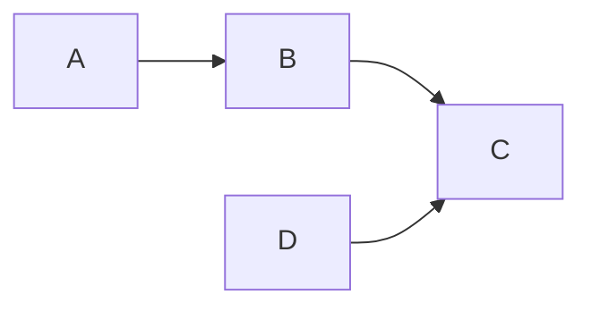

<!---
The Data Product (DP) document is used to record the high level metadata for a data product. This document will be used to communicate the ownership, price, and quality attributes of a specific data product.

File name: DP-###_<Data Product>.md
--->

### Product
**Name:** { ... }  
**Product ID:** { ... }  
**Visibility:** {  private, organization, public }  
**Status:** { announcement, draft, development, testing, acceptance, production, sunset, retired }  
**Type:** { raw data, derived data, dataset, reports, analytic view, 3D visualization, algorithm, decision support, automated decision-making, data-enhanced product, data-driven service, data-enabled performance, bi-directional }  

### Pricing
**Pricing Name:** { ... }  
**Price Currency:** { [ISO 4217 currency format](https://en.wikipedia.org/wiki/ISO_4217) }  
**Price:** { ... }  
**Billing Duration:** { instant, day, week, month, year }
**Unit:** { one-time-payment, pay-per-use, recurring, revenue-sharing, data-volume , pay-what-you-want }  
**Max Transaction Quantity:** { ... }  

### Data Holder
**Legal Name:** { ... }  
**Business ID:** { ... }  
**eMail:** { ... }  

### Data SLA (Optional)
**Update Frequency:** { milliseconds, seconds, minutes, days, weeks, months, years, never, null }  
**Uptime:** { X%, #, best effort }  
**Response Time:** { X milliseconds, seconds, null }  
**Null Values:** { % }  
**Support:** { ... }  
**Support Service Hours:** { ... }  
**Support eMail:** { ... }  
**Support Chat URL:** { ... }  
**SLA Documentation URL:** { ... }  
**SLA Dashboard URL:** { ... }  

### Data Pipeline

**Data Pipeline Name:** { ... }  
**Composer:** { execution engine }  
**Format:** { language }  
**Status:** { announcement, draft, development, testing, acceptance, production, sunset, retired }  
**Script URL:** { ... }  
**Pipeline Documentation URL:** { ... }  
**Monitoring Dashboard URL:** { ... }  

### Data Access
**Name:** { ... }  
**Type:** { API, SQL, sFTP, gRPC }  
**Format:** { JSON, CSV, Parquet }  
**Specification URL:** { ... }  
**Data Access Documentation URL:** { ... }  

----

[Open Data Product Specification](https://opendataproducts.org/)