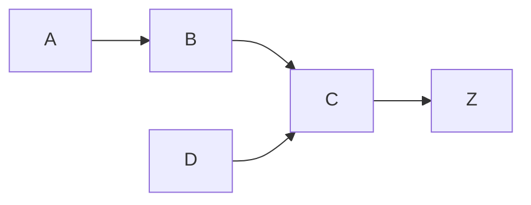

<!---
The Data Product Context (DPC) document is used to record the high level features and associated requirements for a data product. This document will be used to help describe the work to be done.

File name: DPC-###_<Data Product>.md
--->

!!! tldr "TL;DR"  
    { Lorem ipsum dolor sit amet }  

    **IN ORDER TO** { ... }  
    **AS A** { ... }  
    **I WANT** { ... }  

!!! info  
    **Status:** { **CREATED** | IN REVIEW | STARTED | COMPLETED | CANCELED }  
    **Business Contact Name:** { name }  
    **Business Contact email:** { email }  
    **Technical Contact Name:** { name }  
    **Technical Contact email:** { email }  
    **Other contributors:** { email }  
    **Linked PRD / RFC:** [RFC-###]()  

**LINK:**  { [URL]() }  

### Customer Motivation
#### Triggering Event
When { ... }  
#### Core Problem
We [observe, can't, predict] { ... }  
#### Bootstrap
Today, they { ... }  
#### Options
They [could] also { ... }  
#### Old Habits
They keep doing this because { ... }  

----

### Solution Scope
#### Business value
We will gain { ... }  

#### Business Questions
By answering { ... }  

#### Data & Metrics
Through the use of { ... }  

#### Business Events
Triggered by these actions { ... }  

#### New Habits 
We want them to { ... }  

#### Domains
The domains are { ... }  

#### Integration Pattern
Data will be accessed [integrated] through { ... }  

#### Decision Timing
Decisions are made every { ... }  

#### Delivery Pattern
The solution will be accessed through { ... }  

#### Beliefs & Assumptions
Assuming { ... }  

----

### Value Chain
<!--- Illustrate the value chain components or process flow using [Mermaid](https://mermaid-js.github.io/mermaid/#/) notation. --->

### Target Value
<!--- Document the expected financial impact of this project. May be expressed as quantity or quality values.--->
| Units Sold | Unit Price | Raw Materials (TVC) | Operating Expanse | Financial Throughput |
|---|---|---|---|---|
| { # } | { $ } | { $ } | { $ } | { $ } |
| { increased } | { same } | { 3 contract devs. } | { increased $1000/mo } | { Increased } |

----

### Technical Considerations
#### Event / Data Sources
The data is produced by [in] { ... }  

#### Data Size
|Entity|Table count|Record Count|Record Size|Rate of Change|
|---|---|---|---|---|
| { ... } | { # } | { # } | { # } | { ... } |

#### Custom Reports
- { Report description }  
- { Report description }  
- { Report description }  

#### Technical Assumptions
- { Assumption 1 }  
- { Assumption 2 }  
- { Assumption 3 }  

#### Duration
 { Estimated [actual] end-to-end duration }  

----

### References and notes
{ Lorem ipsum dolor sit amet, consectetur adipiscing elit, sed do eiusmod tempor. }
