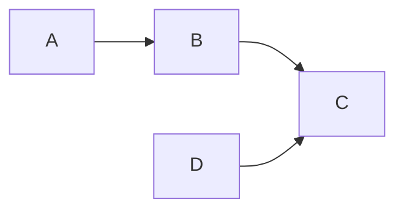

<!---
The Run Book (RB) document is used to document the troubleshooting instructions for a product

File name: RB-###_<Product>.md
--->

**Description:** 
{ Lorem ipsum dolor sit amet }

!!! info  
    **Version:** { ... }  
    **Version Date:** { YYYY-MM-DD }  
    **Contact Name:** { name }  
    **Contact email:** { email }  
    **Linked Run Book:** [RB-XXX]()  

### Architecture
High-level architectural diagram of the system or service. This will help provide context for troubleshooting the alert or outage.

### Application monitoring
The following applications are used to monitor this service.

|Application|Function|
|---|---|
|{ Application name }|{ Metrics and Alerts }

### Known Errors
The following known errors with this service.

!!! failure "Failure Mode - Title"
    **Description:** { ... }  
    **Impacted services:** { ... }  
    **Primary system:** { ... }  
    **Steps to reproduce:** { ... }  
    **Workaround:** { ... }  
    **Solution:** { ... }  

!!! danger "Assessment"
    **Probability (P):** { Extremely unlikely, Remote, Occasional, Reasonably possible, Frequent }  
    **Severity (S):** { No relevant effect on reliability or safety, Very minor (no damage, no injuries, only results in a maintenance action), Minor (low damage, light injuries), Critical, Catastrophic}  
    **Detection (D):** { Certain, Almost certain, High, Moderate, Low (Fault is undetected by operators or maintainers) }  
    **Risk Priority Number (RPN - P*S*D):** { Low, Moderate, High, Unacceptable }

### Troubleshooting
List the troubleshooting steps that will help you restore service.

|Step|Step instructions|Where executed|Environment|Link|
|---|---|---|---|---|
|#|{ ... }|{ ... }|{ ... }|{ ... }|{ [link]() }|

### References and notes
{ Lorem ipsum dolor sit amet, consectetur adipiscing elit, sed do eiusmod tempor. }

----
[Confluence ITSM Runbook Template](https://www.atlassian.com/software/confluence/templates/itsm-runbook)  
[Confluence ITSM known errors template](https://www.atlassian.com/software/confluence/templates/itsm-known-errors)  
[Failure Mode Effects Analysis (FMEA)](https://en.wikipedia.org/wiki/Failure_mode_and_effects_analysis)  
