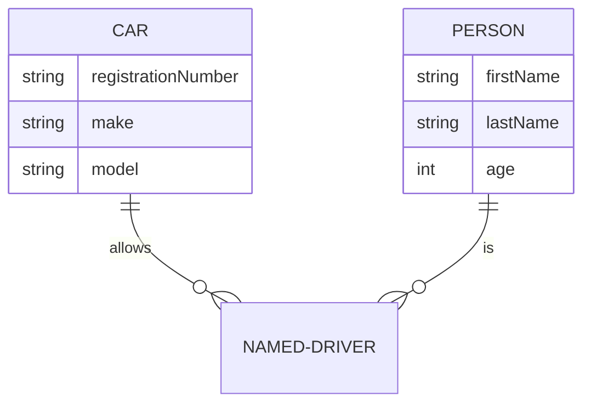

<!---
The Request for Comment (RFC) document is used to record the discussion around a particular topic in order to arrive at a common understanding.

File name: RFC-###_<TITLE>.md
--->

<!--- The RFC begins with a brief overview. This section should be one or two paragraphs that just explains what the goal of this RFC is going to be, but without diving too deeply into the "why", "why now", "how", etc. Ensure anyone opening the document will form a clear understanding of the RFCs intent from reading this paragraph(s).--->
### Overview
{ Lorem ipsum dolor sit amet, consectetur adipiscing elit, sed do eiusmod tempor. }  

!!! info  
    **Status:** { **CREATED** | IN REVIEW | APPROVED | OBSOLETE }  
    **Business Contact Name:** { name }  
    **Business Contact email:** { email }  
    **Technical Contact Name:** { name }  
    **Technical Contact email:** { email }  
    **Approvers:** { email }  
    **Other contributors:** { email }  
    **Linked RFC / PRD / ADR / BDR:** [PRD-XXX]()  

|Created Date|Reviewed Date|Approved Date|Obsolete Date|
|---|---|---|---|
|{ YYYY-MM-DD }|{ YYYY-MM-DD }|{ YYYY-MM-DD }|{ YYYY-MM-DD }|


### Background
<!-- The next section is the "Background" section. This section should be at least two paragraphs and can take up to a whole page in some cases. The guiding goal of the background section is: as a newcomer to this project (new employee, team transfer), can I read the background section and follow any links to get the full context of why this change is necessary?

If you can't show a random engineer the background section and have them acquire nearly full context on the necessity for the RFC, then the background section is not full enough. To help achieve this, link to prior RFCs, discussions, and more here as necessary to provide context so you don't have to simply repeat yourself.--->
{ Lorem ipsum dolor sit amet, consectetur adipiscing elit, sed do eiusmod tempor. }  

### Proposal
<!---The next required section is "Proposal" or "Goal". Given the background above, this section proposes a solution. This should be an overview of the "how" for the solution, but for details further sections will be used.--->
{ Lorem ipsum dolor sit amet, consectetur adipiscing elit, sed do eiusmod tempor. }  

### Section X
#### Implementation (example)
<!---Many RFCs have an "implementation" section which details how the implementation will work. This section should explain the rough API changes (internal and external), package changes, etc. The goal is to give an idea to reviews about the subsystems that require change and the surface area of those changes. 

This knowledge can result in recommendations for alternate approaches that perhaps are idiomatic to the project or result in less packages touched. Or, it may result in the realization that the proposed solution in this RFC is too complex given the problem.

For the RFC author, typing out the implementation in a high-level often serves as "rubber duck debugging" and you can catch a lot of issues or unknown unknowns prior to writing any real code.--->
{ Lorem ipsum dolor sit amet, consectetur adipiscing elit, sed do eiusmod tempor. }  

````mermaid
gantt
    title A Gantt Diagram
    dateFormat  YYYY-MM-DD
    section Section
    A task           :a1, 2014-01-01, 30d
    Another task     :after a1  , 20d
    section Another
    Task in sec      :2014-01-12  , 12d
    another task      : 24d
````

#### UX (example)
<!-- If there are user-impacting changes by this RFC, it is important to have a "UI/UX" section. User-impacting changes include external API changes, configuration format changes, CLI output changes, etc. 

This section is effectively the "implementation" section for the user experience. The goal is to explain the changes necessary, any impacts to backwards compatibility, any impacts to normal workflow, etc.

As a reviewer, this section should be checked to see if the proposed changes feel like the project in question. For example, if the UX changes are proposing a flag "-foo_bar" but all our flags use hyphens like "-foo-bar", then that is a noteworthy review comment. Further, if the breaking changes are intolerable or there is a way to make a change while preserving compatibility, that should be explored.-->
{ Lorem ipsum dolor sit amet, consectetur adipiscing elit, sed do eiusmod tempor. }  

#### UI (example)
<!--Will this RFC have implications for the web UI? If so, be sure to collaborate with a frontend engineer and/or product designer. They can add UI design assets (user flows, wireframes, mockups or prototypes) to this document, and if changes are substantial, they may wish to create a separate RFC to dive further into details on the UI changes.-->
{ Lorem ipsum dolor sit amet, consectetur adipiscing elit, sed do eiusmod tempor. }  

#### Data (example)
<!--Will there be important data and information flow considerations? Include ER, data flow, process diagrams and discussion here.-->
{ Lorem ipsum dolor sit amet, consectetur adipiscing elit, sed do eiusmod tempor. }  



#### Abandoned Ideas (optional)
<!--As RFCs evolve, it is common that there are ideas that are abandoned. Rather than simply deleting them from the document, you should try to organize them into sections that make it clear they're abandoned while explaining why they were abandoned.

When sharing your RFC with others or having someone look back on your RFC in the future, it is common to walk the same path and fall into the same pitfalls that we've since matured from. Abandoned ideas are a way to recognize that path and explain the pitfalls and why they were abandoned. -->
{ Lorem ipsum dolor sit amet, consectetur adipiscing elit, sed do eiusmod tempor. }  

----

### References and notes
<!--- Is there any additional information that would be useful? --->
{ Lorem ipsum dolor sit amet, consectetur adipiscing elit, sed do eiusmod tempor. }  

----
[HashiCorp's Request for Comment Document](https://works.hashicorp.com/articles/rfc-template)  
[Companies Using RFCs or Design Docs and Examples of These](https://blog.pragmaticengineer.com/rfcs-and-design-docs/)
