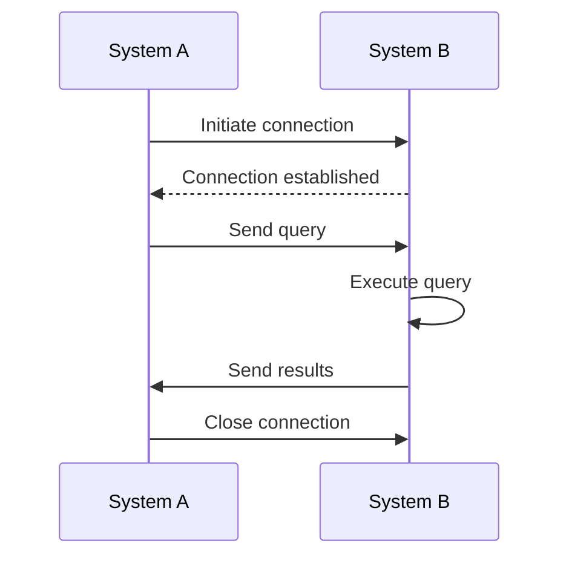

<!---
The Reference document is intended provide the details about a specific subject area.

File name: /documentation/reference/reference_subject.md
--->

### Introduction
{ Lorem ipsum dolor sit amet, consectetur adipiscing elit, sed do eiusmod tempor. }  



<!-- Provide a brief description and links to the details required to understand a specific subject. --->
### Subject
{ Lorem ipsum dolor sit amet, consectetur adipiscing elit, sed do eiusmod tempor. }  

- { Lorem ipsum dolor sit amet }  
- { Lorem ipsum dolor sit amet }  
- { Lorem ipsum dolor sit amet }  

=== "Code"
    ```txt
    <code goes here>
    ```
=== "Results"
    ```
    <When run, it should look like this.>
    ```

!!! note
    { Lorem ipsum dolor sit amet, consectetur adipiscing elit, sed do eiusmod tempor. }

!!! tip
    { Lorem ipsum dolor sit amet, consectetur adipiscing elit, sed do eiusmod tempor. }    

!!! Caution
    { Lorem ipsum dolor sit amet, consectetur adipiscing elit, sed do eiusmod tempor. }  

#### Sub-topic
{ Lorem ipsum dolor sit amet, consectetur adipiscing elit, sed do eiusmod tempor. }  

#### Sub-topic
{ Lorem ipsum dolor sit amet, consectetur adipiscing elit, sed do eiusmod tempor. }  

### Next Steps
- { Lorem ipsum dolor sit amet }  
- { Lorem ipsum dolor sit amet }  
- { Lorem ipsum dolor sit amet }  
